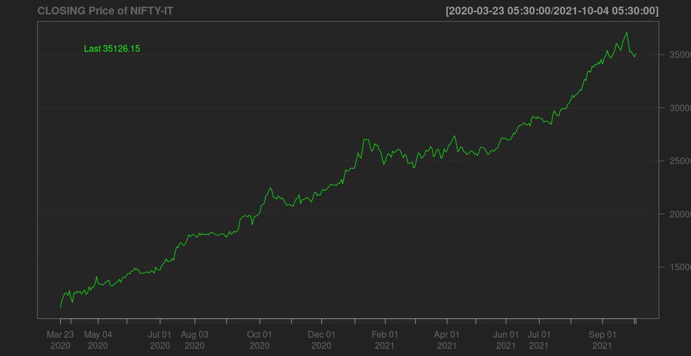
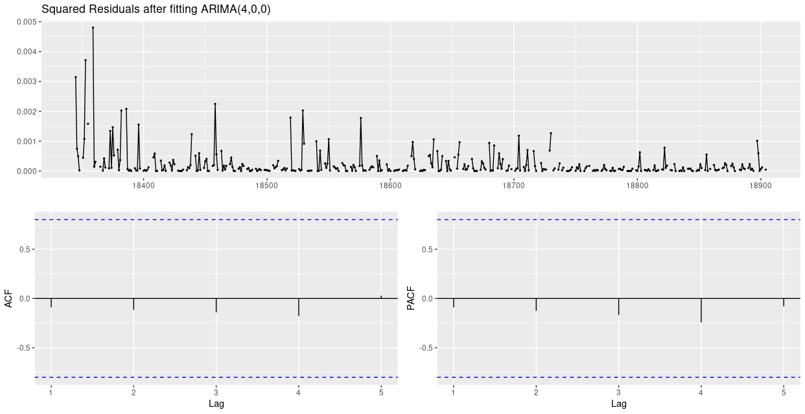
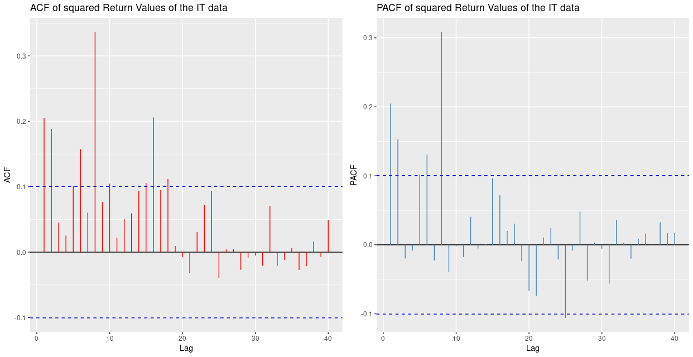
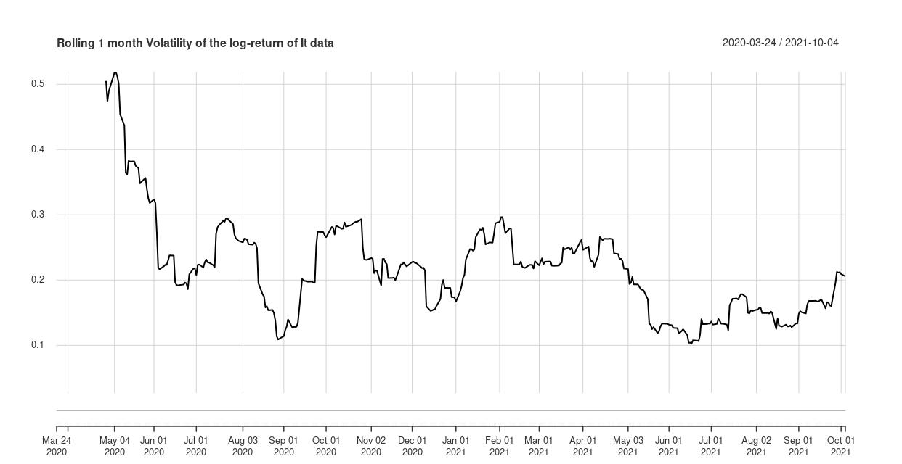
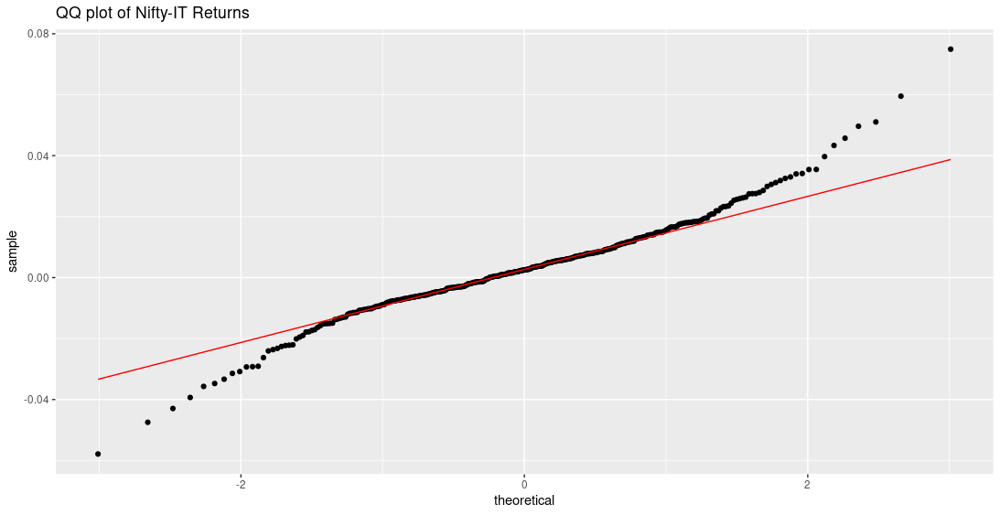

# NIFTY-Share-Market-Price-Prediction
Time series analysis on NIFTY data ( bank,oil,metal,it ) using GARCH model in R.


# Content:
- `[a] Introduction `
- `[b] What is Time Series Analysis`
- `[c] Difference from Regression analysis`
- `[d] Stationarity,Random Walk, White Noise, IID`
- `[e] Steps to follow serially`
- `[f] About Finance Data and Datasets`
- `[g] Which model and why?`
- `[h] Data visualization [EDA]`
- `[i] Log returns`
- `[j] Analysis on Log-Returns`
    - `[a] Augmented Dicky Fuller test [Unit root test]`
    - `[b] ACF, PACF of Log-returns `
    - `[c] Mean model [ARIMA] selection `
    - `[D] Observation of the residuals after fitting ARIMA model`
- `[k] Square Log-Returns to observe Volatility`
- `[l] ACF and PACF of the sqr-Log-Returns`
- `[m] Check if Volatility [ARCH effect] is present`
    - `[a] ARCH test`
    - `[b] Monthly rolling average volatility`
- `[n] GARCH model selection:`
    - `[a] Following the distribution of the log-returns`
    - `[b] Guess about the order of the model ( IF POSSIBLE )`
    - `[c] AIC,AICc,BIC value`
    - `[d] choosing the best model `
- `[o] Forcasting with the best model`
- `[p] References`

            “I will tell you how to become rich. Close the doors. Be fearful when others are greedy.
            Be greedy when others are fearful.”                                – By Warren Buffett

###

# `[a] Introduction: `
 In time series analysis, time is a significant variable of the data. Times series analysis helps us study our world and learn how we progress within it. Time series analysis can indeed be used to predict stock trends. Stock markets are where individual and institutional investors come together to buy and sell shares in a public venue. Nowadays these exchanges exist as electronic marketplaces. The supply and demand helps to determine the price for each security or the levels at which stock market participants - investors and traders - are willing to buy and sell. A stock or share (also known as a company’s “equity”) is a financial instrument that represents ownership in a company. There are many indexes out of which NIFTY is a diversified  stock index. It is used for a variety of purposes such as benchmarking fund portfolios, index based derivatives and index funds. There are two main stock exchanges in India that make up the stock markets. One of them is Bombay Stock Exchange (BSE) and the other one is the National Stock Exchange (NSE). NIFTY is owned and managed by NSE Indices Limited (formerly known as India Index Services & Product Limited) (NSE Indices). NSE Indices is India’s specialized company focused upon the index as a core product. In this project we are going to analyze and implement different models step by step in order to get a model which would be best suited for prediction or forecasting purpose. We use the log return of the stock prices of some stock of the NIFTY, i.e. BANK, OIL,IT and METAL Banks and  we are going to take only the daily closing prices of then and then try to fit a traditional model i.e. ARMA model and found the best model according to the AIC and BIC values and again check whether there is any ARCH effect or not i.e. to check for the presence of Heteroskedasticity in the data. If present then we model the variance part through ARCH and GARCH model and found the best mean and variance model which would capture all the cluster volatility and the bursts in the data and would forecast appropriately. The caveat out here is 100% accuracy in prediction is not possible but still using time series analysis we can develop some model which will give us an idea or a prediction of how the next few days stock price would be.


# `[b] What is Time Series Analysis?`

Time series analysis is a statistical technique that deals with time series data, or trend analysis.  Time series data means that data is in a series of  particular time periods or intervals. This is a specific way in which analysts record data points at consistent intervals over a set period of time rather than just recording the data points intermittently or randomly. What sets time series data apart from other data is that the analysis can show how variables change over time. In other words, time is a crucial variable because it shows how the data adjusts over the course of the data points as well as the final results. It provides an additional source of information and a set order of dependencies between the data.
    Time series analysis typically requires a large number of data points to ensure consistency and reliability. An extensive data set ensures you have a representative sample size and that analysis can cut through noisy data. It also ensures that any trends or patterns discovered are not outliers and can account for seasonal variance. Additionally, time series data can be used for forecasting—predicting future data based on historical data.

    Examples of time series analysis in action include:
    Weather data
    Rainfall measurements
    Temperature readings
    Heart rate monitoring (EKG)
    Brain monitoring (EEG)
    Quarterly sales
    Stock prices
    Automated stock trading
    Industry forecasts
    Interest rates

 
# `[c] Difference from Regression analysis :`
We have to follow first that Regression is a mathematical model to make relation between variables, and it is being used in Time series analysis also to remove trend. So, regression helps us to get the trend, and after removing trend( with the help of regression) and seasonality by some other method( like differencing) we have to check wheathere the series is Stationary(discussed later) or not and then we can approach for the time series model accordingly. we can even think of time series as an extension of linear regression. Time series uses terms such as autocorrelation and moving average to summarize historical information of the y variable with the hope that these features better predict future y. So, there is a difference one should be clear about.
Again, Regression can also be applied to non-ordered series where a target variable is dependent on values taken by other variables. These other variables are called as Features. When making a prediction, new values of Features are provided and Regression provides an answer for the Target variable.So unlike time series analysis, we need some feature to predic. Essentially, Regression is a kind of intrapolation technique. Regression can be applied to Time-series problems as well. e.g. Auto-regression.
So, in a simple way,
* Time-series forecast is Extrapolation [ out side the given data ] and realation between target variable and time.
* Regression is Intrapolation [ inside the given data also ] and relation between target variable and features.

# `[d] Stationarity, White Noise, IID`

- [x] `Stationarity:`
A time series has stationarity if a shift in time doesn't cause a change in the shape of the distribution. Basic properties of the distribution like the mean , variance and covariance are constant over time. In the most intuitive sense, stationarity means that the statistical properties of a process generating a time series do not change over time . It does not mean that the series does not change over time, just that the way it changes does not itself change over time. A common assumption in many time series techniques is that the data are stationary.Stationarity can be defined in precise mathematical terms, but for our purpose we mean a flat looking series, without trend, constant variance over time, a constant autocorrelation structure over time and no periodic fluctuations (seasonality).\
- [ ] Data points are often non-stationary or have means, variances, and covariances that change over time. Non-stationary behaviors can be trends, cycles, random walks, or combinations of the three.Non-stationary data, as a rule, are unpredictable and cannot be modeled or forecasted. In order to receive consistent, reliable results, the non-stationary data needs to be transformed into stationary data with one of the following techniques:
```
** non stationarity in mean:
        * deterministic trend-
               * detranding
        * stochastic trend-
               * differencing
** non stationarity in variance:
** non stationaritiy due to both mean and variance
```
* We can difference the data. That is, given the series Zt, we create the new series
Yi=Zi−Zi−1.
The differenced data will contain one less point than the original data. Although you can difference the data more than once, one difference is usually sufficient.
* If the data contain a trend, we can fit some type of curve to the data and then model the residuals from that fit. Since the purpose of the fit is to simply remove long term trend, a simple fit, such as a straight line, is typically used.
* For non-constant variance, taking the logarithm or square root of the series may stabilize the variance. For negative data, you can add a suitable constant to make all the data positive before applying the transformation. This constant can then be subtracted from the model to obtain predicted (i.e., the fitted) values and forecasts for future points.
The above techniques are intended to generate series with constant location and scale. Although seasonality also violates stationarity, this is usually explicitly incorporated into the time series model.

- [ ] Types of Stationary
Models can show different types of stationarity:

**Strict stationarity** means that the joint distribution of any moments of any degree (e.g. expected values, variances, third order and higher moments) within the process is never dependent on time. This definition is in practice too strict to be used for any real-life model.
**First-order** stationarity series have means that never changes with time. Any other statistics (like variance) can change.
**Second-order** stationarity (also called weak stationarity) time series have a constant mean, variance and an autocovariance that doesn’t change with time. Other statistics in the system are free to change over time. This constrained version of strict stationarity is very common.
**Trend-stationary** models fluctuate around a deterministic trend (the series mean). These deterministic trends can be linear or quadratic, but the amplitude (height of one oscillation) of the fluctuations neither increases nor decreases across the series.
**Difference-stationary** models are models that need one or more differencings to become stationary (see Transforming Models below).

- [ ] It can be difficult to tell if a model is stationary or not. Unlike some visible seasonality , you usually can’t tell by looking at a graph. If we aren’t sure about the stationarity of a model, a hypothesis test can help. we have several options for testing, including:
* Unit root tests (e.g. Augmented Dickey-Fuller (ADF) test or Zivot-Andrews test),
* A KPSS test (run as a complement to the unit root tests).
* A run sequence plot,
* The Priestley-Subba Rao (PSR) Test or Wavelet-Based Test, which are less common tests based on spectrum analysis.\
Though we will use only the Unit root test here. (To know more about it)[https://www.investopedia.com/articles/trading/07/stationary.asp]

- [x] `Random Walk:`
 


consider a AR(1) model. 


As long as |α| < 1 , it is stationary and everything is fine. Now let's consider the extreme case where  |α| = 1 ,i.e, 


+e_t)


This is what we call random walk with drift. If, c=0 it is a `random walk`.
- [ ] Examples of Random Walk process:

 - Behaviour of stock market
 - Brownian motion
 - Movement of a drunken man
 - It is a limiting process of AR(1)


- [x] `White Noise and IID:`
A white noise process is only defined by the first 2 moments. A noise sequence (et) is a white noise sequence if\
the expectation of each element is zero, E(et) = 0\
the variance of each element is finite, Var(et) < infinity\
the elements are uncorrelated, Cor(et, es) = 0\
But it does not specify higher moments of the distribution, like skewness and kurtosis. IID white noise provides that the sample has the same distribution, so also higher moments have to be the same. The noise sequence would be an iid noise if in addition the elements are not just uncorrelated but also independet. So therefore every iid noise is also white noise, but the reverse is just true for Gaussian white noise sequence. A Gaussian white noise implies a normal distribution of et and a normal distribution is completely defined by the first 2 moments. So in this case: White noise process = Iid white noise.  IID is a special case of white noise. So, the difference is that for iid noise we assume each sample has the same probability distribution while, white noise samples could follow different probability distribution.
The concept of iid is used when we make assumptions about the error, e.g. in regression analysis when we say that the error terms are iid following normal with mean 0 and a common variance sigma^2. However the concept of white noise is used in time series analysis, when we make more complicated models like random walk or ARMA or ARIMA models.

# `[e] Steps to follow serially:`
The following steps are to be followed:
1. Visualization of data
2. Removing trend and seasonality
3. chechiking stationarity of the residuals
4. fitting best ARIMA model
5. if residuals are stationary but there is still volatility is present check if ARCH effect is present or not
6. if present then to model the variance use GARCH model
7. choosing best ARMIA + GARCH model to model mean and variance at the same time.


# `[f] About Finance Data and Datasets`
A financial information is a formal record of the financial activities of a business, person, or other entity. Relevant financial information is presented in a structured manner and in a form easy to understand. Financial data consists of pieces or sets of information related to the financial health of a business. The pieces of data are used by internal management to analyze business performance and determine whether tactics and strategies must be altered. People and organizations outside a business will also use financial data reported by the business to judge its credit worthiness, decide whether to invest in the business, and determine whether the business is complying with government regulations.  
NFI(non financial information) is associated with information that is not expressed in financial terms. NFI is a system of information that does not necessarily derive from the accounting system. NFI is not related to financial and economic data. 

### When is Log Transformation Necessary for Financial Returns?
There are a lot of benefits in using the log return or compounded return over the simple one. Some of these are lognormality, raw log equality, and low algorithmic complexity. Finally, use log return when temporal behavior of return is the focus of interest.
Returns for stock prices are normally distributed but prices are not. They are lognormally distributed (assumed at least and require verification per case).
let us discuss when should you use simple returns over compounded returns

Using non-stationary time series data in financial models produces unreliable and spurious results and leads to poor understanding and forecasting. The solution to the problem is to transform the time series data so that it becomes stationary. If the non-stationary process is a random walk with or without a drift, it is transformed to stationary process by differencing. On the other hand, if the time series data analyzed exhibits a deterministic trend, the spurious results can be avoided by detrending.
Sometimes the non-stationary series may combine a stochastic and deterministic trend at the same time and to avoid obtaining misleading results both differencing and detrending should be applied, as differencing will remove the trend in the variance and detrending will remove the deterministic trend.
### Why Log Returns: 
- [ ] `LINEAR RETURN VS. COMPOUND RETURNS:`
The linear return is defined as-

 

Linear Return has the property of being asset-additive that is, you can aggregate the returns more easily. In equation form, if we denote w_1,w_2,w_3,...,w_n as the corresponding weights of n securities, the portfolio returns are simply:

Where L(t,p) = Portfolio Return using Linear Returns\
Linear returns are therefore being used by risk and portfolio managers for risk analysis, performance attribution, and portfolio optimization.
Compound Returns, however, are calculated using the following formula:


Compounded returns are time-additive that is, you can add them across time to get the total return over a specified period. Others benifits are-\
**LOGNORMALITY**
A common assumption for most assets or stocks is that their prices are log-normally distributed. One reason for this is that prices cannot assume a negative value and as the stock price goes closer to 0, the movement becomes smaller.


Formulation of lognormal distribution of prices. The reason for this is that prices change over time and so is the variance of the price. So instead of using the marginal distribution, we are using the conditional distribution.
What does this mean? If the log of price is normally distributed, then:


A happy benefit of this is that there are a lot of tried-and-tested tools, theories, and methods that can be applied when a variable is normally distributed depending on your objective.\
**RAW-LOG RETURN EQUALITY**
When (ri) is small, then:


The approximation is considered good and is relevant for small trades.\
**ALGORITHMIC COMPLEXITY**
Assume for example that a stock is traded, n-times, on a daily basis. To get the compound return:


*We know that the product of two normal variables is not normally distributed.
The log of return, however, resolves these difficulties naturally.*
Using the formula for the log of returns:


So, to calculate an n-week (or daily) return, we can apply the formula:


We know that we can decompose the equation to:


Thus, the algorithmic complexity is reduced from `O(n)` multiplications to just an `O(1)` addition.
This is extremely helpful for large (n)s.
Furthermore, probability theory tells us that the sum of normally distributed variables is a normally distributed variable itself.


### `About The Datasets:`
We shall take 4 stock data named NIFTY-bank, NIFTY-oil, NIFTY-metal and NIFTY-it. The data is collected from [here](https://www1.nseindia.com/products/content/equities/indices/historical_index_data.htm). Each of them contains 7 different column as shown:


we will take data from 23rd march 2020 to 4th october 2021. Because there due to codiv-19 there was a sudden fall in all stock. So modeling before that is less significant. We will take only closiing price for modeling. 


# `[g] Which model and why?`
One of the assumptions of the ARMA model is that the error term are either strongly or weakly stationary. But the problem is that in real life this assumption is not always satisfied. Indeed, when looking financial data such as stock market data (AAPL, TESLA, GOOGL) or currency data (EUR/USD, GBP/USD), even indices data ( S&P 500, DAX 30, US30, NASDAQ 100 etc.) and cryptocurrency. Usually these data display an error term which presents a sort of stochastic variation of their volatility over time, meaning that considering the stationarity assumption will lead to a misspecification of the model estimation and therefore will lead to a bad forecast. GARCH models are usually the one considering such heteroskedasticity of the error terms and the stochastic change of their related volatility.
GARCH stands for Generalized Autoregressive Conditional Heteroskedasticity Models. GARCH models are commonly used to estimate the volatility of returns for stocks, currencies, indices cryptocurrencies.

There exist a large variety of GARCH model : Standard GARCH (SGARCH), Nonlinear GARCH (NGARCH), Nonlinear Asymetric GARCH (NAGARCH), Integrated GARCH (IGARCH), Exponential GARCH (EGARCH), GARCH in Mean (GARCH-M), Quadratic GARCH (QGARCH), Glosten-Jagannathan-Runke GARCH (GJR-GARCH), Treshold GARCH (TGARCH), Family GARCH (FGARCH), Continuous-time GARCH (COGARCH), Zero drift GARCH (ZDGARCH) etc. I will present only two of these variants : the standard GARCH and the GJR-GARCH models.

**The standard GARCH Model**

To model the GARCH model, we need to know first how the ARCH model is set. So let us consider the error term e[t] or the residual from the demeaned return. Then the error term is decomposed into two main terms that are the stochastic term z[t] and the time-dependent standard deviation s[t] such that :
R[t] = mu + e[t]
e[t] = s[t]*z[t]. 
Where R[t] is the variable representing the time series of the return of the stock considered, mu is the mean and e[t] is the error term. The variable z[t] is assumed to be a strong white noise process. If we consider that q is the number of lags for the volatility modelling (ARCH(q)), then, we have


where alpha_0 >0 and alpha_i >= 0 for i>0

Therefore, an ARCH(q) model means that the time-dependent volatility depends on the first q lag squared values of the error term.


Then, based on the ARCH(q) model, we can define the model setting of the GARCH. Indeed, the GARCH model is considered when the error variance s[t] is assumed to follow an ARMA process. In that situation, the GARCH(p,q) model with p the number of lags of the s[t] terms and q the number of lags for the ARCH terms e[t]^2. 


Therefore, the main difference between the GARCH model and the ARCH model is that the GARCH model consider also the volatility of the previous period, while the ARCH model do not. This is truly important as in the financial market we can usually observe mean reverting patterns of the instruments/variables and this mean-reverting pattern can in some case could happen by respecting a certain average range, meaning that the volatility of the previous periods should be considered.


)


Then, a GARCH(1,1) is such that 

and the ARCH(1) model is nothing else than the GARCH(0,1) model.

The particularity of the standard GARCH model is that we consider that the conditional error term follows a normal distribution. This is not always the case for all types of data. We usually observe in the financial data more skewed data.  Therefore, we should also consider checking if the residuals follow that pattern. The GARCH model with skewed student t-distribution (STTD) is usually considered as an alternative to the normal distribution in order to check if we have a better model fitting. 


# `[h] Data visualization [EDA]:`
Finance is a field where time series arises naturally from the evolution of indexes and prices.
So the financial data which I have worked on the Nifty daily stock index (i.e. closing
prices) of IT,METAL,BANK,OIL. So here we have 4 time series. Now we take one
stock at a time and try to analyze and then fit an appropriate model to forecast.

* Libraries used:

```
library(PerformanceAnalytics)
library(astsa)
library(itsmr)
library(lubridate)
library(zoo)
library(randtests)
library(forecast)
library(urca)
library(aTSA)
library(ggplot2)
library(tsoutliers)
library(gridExtra)
library(rugarch)
library(tseries)
library(quantmod)
```

* Data Loading and ploting the time series data:
```
nifty_it <- read.csv('/home/mahendra/Downloads/sem_3/TSA/project/data/it_data.csv')
nifty_it <- nifty_it[852:1233,c(3,7)]
dim(nifty_it)          #### (382 x 2)
nifty_it[,1] <- dmy(nifty_it[,1])
#plot(nifty_it$Close, ylab="Stock Prices",main="Figure : Closing prices of the stocks",type = 'l')
tso_it <- zoo(nifty_it$Close, nifty_it$Date)
#plot(tso_it)
it <- data.frame(xts(nifty_it$Close, order.by=as.POSIXct(nifty_it$Date)))
names(it) <- "it closed"
chartSeries(it, type = "line", show.grid = TRUE,name = "CLOSING Price of NIFTY-IT")
```



Data taken are on daily basis. Closed prices are only taken for analysis and the currency in which the stock prices are recorded are in rupees. The time stamp on the data is from 23rd March, 2020 to 4th october 2021. 


# `[i] Log returns:`
The next step is the calculation of the daily return of the price and display it. For the return calculation we use the function CalculateReturns(). Here is the related code.We use again the function charSeries() in order to display the time series of the returns. 


Here is the graph of the returns.As we can see there the time series of  returns is almost zero mean(0.003) and the returns displays for some random day very high volatility, meaning that the standard stationarity won't work here.


# `[j] Analysis on Log-Returns:`

### `[j][a] Augmented Dicky Fuller test [Unit root test]:`

[ I will request you to kindly go through the explanation already given in wikipidea about [Dickey-Fuller-Test](https://en.wikipedia.org/wiki/Dickey%E2%80%93Fuller_test) and [Augmented-Dickey-Fuller-Test](https://en.wikipedia.org/wiki/Augmented_Dickey%E2%80%93Fuller_test)
and then go through the below part. Here are some ambiguous with the notation but you can get it easily. ]
As we aren’t sure about the stationarity of a model, a hypothesis test can help us,It is from the test statistic and the p-value, you can make an inference as to whether a given series is stationary or not.
* Unit root test: 
The ADF test belongs to a category of tests called ‘Unit Root Test’, which is the proper method for testing the stationarity of a time series. Unit root is a characteristic of a time series that makes it non-stationary. Technically speaking, a unit root is said to exist in a time series of the value of alpha = 1 in the below equation.


where, Yt is the value of the time series at time ‘t’ and Xe is an exogenous variable (a separate explanatory variable, which is also a time series). The presence of a unit root means the time series is non-stationary. Besides, the number of unit roots contained in the series corresponds to the number of differencing operations required to make the series stationary.

* Dicky Fuller test:
Before going into ADF test, let’s first understand what is the Dickey-Fuller test. A Dickey-Fuller test is a unit root test that tests the mull hypothesis that α=1 in the following model equation. alpha is the coefficient of the first lag on Y. Null Hypothesis (H0): alpha=1


where,
y(t-1) = lag 1 of time series
delta Y(t-1) = first difference of the series at time (t-1)
Fundamentally, it has a similar null hypothesis as the unit root test. That is, the coefficient of Y(t-1) is 1, implying the presence of a unit root. If not rejected, the series is taken to be non-stationary.

* Augmented Dickey Fuller (ADF): 
The Augmented Dickey-Fuller test evolved based on the above equation and is one of the most common form of Unit Root test. As the name suggest, the ADF test is an ‘augmented’ version of the Dickey Fuller test.
Before we run an ADF test, inspect our data to figure out an appropriate regression model. For example, a nonzero mean indicates the regression will have a constant term. The three basic regression models are:

No constant, no trend: Δyt = γyt-1 + et\
Constant, no trend: Δyt = c + γyt-1 + et\
Constant and trend: Δyt = c + γyt-1 + βt + et

The ADF test expands the Dickey-Fuller test equation to include high order regressive process in the model,i.e, adds lagged differences to these models. We need to choose a lag length to run the test. The lag length should be chosen so that the residuals aren’t serially correlated. We’ve got several options for choosing lags: Minimize Akaike’s information criterion (AIC) or Bayesian information criterion (BIC), or drop lags until the last lag is statistically significant.


The hypotheses for the test:
The null hypothesis for this test is that there is a unit root.
The alternate hypothesis differs slightly according to which equation you’re using. The basic alternate is that the time series is stationary (or trend-stationary). The augmented Dickey–Fuller (ADF) statistic, used in the test, is a negative number. The more negative it is, the stronger the rejection of the hypothesis that there is a unit root at some level of confidence
        So, for a simple autoregressive process[AR(1)] we need the Dickey Fuller Test and Since the test is done over the residual term rather than raw data, it is not possible to use standard t-distribution to provide critical values. Therefore, the test statistic has a specific distribution simply known as the Dickey–Fuller table. But for AR process wiith more lag has other coeeficients too ( here It is denoted by φ ) for those we can use a typical t-distribution but for the α we use DF distribution.
Test Statistics are 

}) 

and

}) 
******************************
In this repo you can find one jupyter notebook where I have also colleceted and practiced some codes. In section-10 there a hands on verification of this test is done. check that.
R code for ADF test:
```

summary(ur.df(na.omit(Return_it)))
```
Output:
```
############################################### 
# Augmented Dickey-Fuller Test Unit Root Test # 
############################################### 
Test regression none 
Call:
lm(formula = z.diff ~ z.lag.1 - 1 + z.diff.lag)

Residuals:
      Min        1Q    Median        3Q       Max 
-0.059141 -0.004664  0.002614  0.010644  0.069094 

Coefficients:
           Estimate Std. Error t value Pr(>|t|)    
z.lag.1    -1.10876    0.07131  -15.55   <2e-16 ***
z.diff.lag  0.09206    0.05004    1.84   0.0666 .  
---
Signif. codes:  0 ‘***’ 0.001 ‘**’ 0.01 ‘*’ 0.05 ‘.’ 0.1 ‘ ’ 1

Residual standard error: 0.01514 on 377 degrees of freedom
Multiple R-squared:  0.5153,	Adjusted R-squared:  0.5127 
F-statistic: 200.4 on 2 and 377 DF,  p-value: < 2.2e-16

Value of test-statistic is: -15.5482 

Critical values for test statistics: 
      1pct  5pct 10pct
tau1 -2.58 -1.95 -1.62

```
The value of the test statistic is in rejection regeion, i.e, there is signifant evedence to reject the null hypothesis that the time series has unit root.
So, from this result we can't say that the data is stationary. For this we have to further analysis the ACF and PACF plot and sqr_returns etc.


### `[j][b] ACF, PACF of Log-returns :`

Autocorrelation and partial autocorrelation plots are heavily used in time series analysis and forecasting. These are plots that graphically summarize the strength of a relationship with an observation in a time series with observations at prior time steps.

Lets understand Correlation and Autocorrelation. Statistical correlation summarizes the strength of the relationship between two variables. We can assume the distribution of each variable fits a Gaussian (bell curve) distribution. If this is the case, we can use the Pearson’s correlation coefficient to summarize the correlation between the variables. The Pearson’s correlation coefficient is a number between -1 and 1 that describes a negative or positive correlation respectively. A value of zero indicates no correlation. We can calculate the correlation for time series observations with observations with previous time steps, called lags. Because the correlation of the time series observations is calculated with values of the same series at previous times, this is called a serial correlation, or an autocorrelation.
A plot of the autocorrelation of a time series by lag is called the AutoCorrelation Function, or the acronym ACF. This plot is sometimes called a correlogram or an autocorrelation plot.

It is a bar chart of coefficients of correlation between a time series and it lagged values. Simply stated: ACF explains how the present value of a given time series is correlated with the past (1-unit past, 2-unit past, …, n-unit past) values. In the ACF plot, the x-axis expresses the correlation coefficient whereas the y-axis mentions the number of lags. Assume that, y(t-1), y(t), y(t-1),….y(t-n) are values of a time series at time t, t-1,…,t-n, then the lag-1 value is the correlation coefficient between y(t) and y(t-1), lag-2 is the correlation coefficient between y(t) and y(t-2) and so on.


A partial autocorrelation is a summary of the relationship between an observation in a time series with observations at prior time steps with the relationships of intervening observations removed. The partial autocorrelation at lag k is the correlation that results after removing the effect of any correlations due to the terms at shorter lags. The autocorrelation for an observation and an observation at a prior time step is comprised of both the direct correlation and indirect correlations. These indirect correlations are a linear function of the correlation of the observation, with observations at intervening time steps. So, PACF  explains the partial correlation between the series and lags of itself. In simple terms, PACF can be explained using a linear regression where we predict y(t) from y(t-1), y(t-2), and y(t-3) [2]. In PACF, we correlate the “parts” of y(t) and y(t-3) that are not predicted by y(t-1) and y(t-2).


we can plot the ACF and PACF plots to identify the orders of AR and MA terms in the ARMA model. At times, only AR terms or only MA terms are sufficient to model the process. Table 1 explains how to select AR and MA terms based on ACF and PACF [1]:


The ACF and PACF plots should be considered together to define the process. For the AR process, we expect that the ACF plot will gradually decrease and simultaneously the PACF should have a sharp drop after p significant lags. To define a MA process, we expect the opposite from the ACF and PACF plots, meaning that: the ACF should show a sharp drop after a certain q number of lags while PACF should show a geometric or gradual decreasing trend. On the other hand, if both ACF and PACF plots demonstrate a gradual decreasing pattern, then the ARMA process should be considered for modeling.


Blue bars on an ACF plot above are the error bands, and anything within these bars is not statistically significant. It means that correlation values outside of this area are very likely a correlation and not a statistical fluke. The confidence interval is set to 95% by default.
Notice that for a lag zero, ACF is always equal to one, which makes sense because the signal is always perfectly correlated with itself.

 * Here is the acf and pacf of the original stock data[ NIFTY-IT ] :

 
 * And here is the acf pacf plot of the log-return of Nifty-IT data :

 
### `[j][c] Mean model [ARIMA] selection: `
Now, we have seen our original data, we have also seen the Log-return has no unit root. We checked if the return has any auto-corelation, and there are somevery small corelation between data point of various lag. So, now we want to fit ARIMA model to model the mean. And after that checking residuals and sqr-returns we decide fpr GARCH model.
To find the order of the ARIMA we generally follow the acf and pacf plot, but in this case it is not easy. So we will take help of a function in R named `auto.arima()` to find the best order of ARIMA that can alone fit the data. By running the code we found that the best order is ARIMA(4,0,0):\
Code:
```
arima_it <- auto.arima(Return_it)
arima_it
checkresiduals(arima_it)
```
Output:
```
> arima_it
Series: Return_it 
ARIMA(4,0,0) with non-zero mean 

Coefficients:
         ar1      ar2     ar3      ar4   mean
      0.0084  -0.0174  0.0840  -0.0959  3e-03
s.e.  0.0679   0.0707  0.0635   0.0632  8e-04

sigma^2 estimated as 0.0002304:  log likelihood=1056.11
AIC=-2100.23   AICc=-2100.07   BIC=-2074.26
```
Also we test the goodness of thee fit
```
Box.test(na.omit(as.vector(Return_it)), lag = 1, type = "Ljung-Box", fitdf = 0)
```
output:
```
	Box-Ljung test

data:  na.omit(as.vector(Return_it))
X-squared = 0.42253, df = 1, p-value = 0.5157
```
 Null hypothesis is that our model does not shoh lack of fit.
So, the model fit well.

### `[j][D] Observation of the residuals after fitting ARIMA model:`
Code:
```
arima_it <- auto.arima(Return_it)
checkresiduals(arima_it)
```
Output:
```
> checkresiduals(arima_it)

	Ljung-Box test
    
data:  Residuals from ARIMA(4,0,0) with non-zero mean
Q* = 72.178, df = 5, p-value = 3.608e-14

Model df: 5.   Total lags used: 10

```


Here after fitting the ARIMA(4,0,0), the residual looks like white noise and it fits well. But if we deeply follow the residual  we can found that there is a change in volatility.It will be clear from the square of the residual in the plots below

```
arima_res_it <- arima_it$residuals
sq_residual_it <- arima_res_it^2
ggtsdisplay(sq_residual_it,main="Squared Residuals after fitting ARIMA(4,0,0)")
```


So for the purpose of analysing Volatility we will go back to the square of the log-returns.


# `[k] Square Log-Returns to observe Volatility:`


We can see the plot where the squared value of the log retyrn is shown datewise. From this we can follow that there is some peak from which we can get an idea of having ARCH effect,i.e, the heteroskedasticity of the data.  

# `[l] ACF and PACF of the sqr-Log-Returns:`
Now we again follow the ACF and PACF plot to be more confirmed about having heteroskedasticity.



We have seen that there was no significant correlation in the acf anf pacf plot of the return but in case of squared log-return there exists some high corelation Which is actually signifying the existance of heteroskedasticity.


# `[m] Check if Volatility [ARCH effect] is present:`

### `[m][a] Volatility Clustering (Monthly rolling volatility) :`
The next step is to calculate the annualized volatility and the rolling-window volatility of returns. This can be done either at the daily, monthly, quarterly frequency, etc. Here is the code for the monthly. width = 22 (252 for yearly frequency)

```
chart.RollingPerformance(na.omit(Return_it),width = 22,FUN = 'sd.annualized',scale=252, main = 'Rolling 1 month Volatility')

```


Based on this graph, we can still see that there are months with very high volatility and months with very low volatility, suggesting the stochastic model for conditional volatility.

### `[m][b] ARCH test`
```
library(FinTS)
ArchTest(Return_it,lags=1,demean = TRUE)
```
Output:
```
	ARCH LM-test; Null hypothesis: no ARCH effects

data:  Return_it
Chi-squared = 20.964, df = 1, p-value = 4.679e-06
```


# `[n] GARCH model selection:`

Now we can run the GARCH model. We can start with the standard GARCH model where we consider the conditional error term is a normal distribution. We use the  function ugarchspec() for the model specification and ugarchfit() for the model fitting. For the standard GARCH model, we specify a constant to mean ARMA model, which means that arma0rder = c(4,0). We consider the GARCH(1,1) model and the distribution of the conditional error term is the normal distribution (will chack also for skewed student t distributuion).

### `[n][a] Following the distribution of the log-returns`
Now we can display the histogram of returns and try to see if the normal distribution could be used for the conditional error term.
```
chart.Histogram(return_it,methods = c("add.density","add.normal"),
                colorset = c("blue","red","black"),
                main = "histogram of the log-returns of Nifty-IT data")
legend("topright",legend = c("return","kernel","normal dist"),fill = c("blue","red","black"))

```


As we can see, the histogram of the of the returns seems to be more skewed than the normal distribution, meaning that considering the normal distribution for the returns is not a good choice. The student distribution  tends to be the more adapted for this distribution. We will see if that is confirmed by the model estimation. 

```
############## QQ Plot ##############
ggplot(data=nifty_it, aes(sample = as.vector(Return_it))) +
  stat_qq() +
  stat_qq_line(col='red') + ggtitle('QQ plot of Nifty-IT Returns')

```


we can also check the qq plot to visualize the distribution it follows.

### `[n][b] Guess about the order of the model ( IF POSSIBLE ):`
We here will do a sofisticated way of choosing the order of the ARMA + GARH model. We initially fit the best ARMA model alone. But we will se that when we incorporate the GARCH model the order will no more be best for the combination model.

### `[n][c] AIC,AICc,BIC value:`

- [ ] **Akaike Information Criteria (AIC)**
AIC stands for Akaike Information Criteria, and it’s a statistical measure that we can use to compare different models for their relative quality. It measures the quality of the model in terms of its goodness-of-fit to the data, its simplicity, and how much it relies on the tuning parameters. AIC is calculated from:
 - the number of independent variables used to build the model.
 - the maximum likelihood estimate of the model (how well the model reproduces the data).

The formula for AIC is   

 

where l is a log-likelihood, and k is a number of parameters. For example, the AR(p) model has p+1 parameters. From the formula above, we can conclude that AIC prefers a higher log-likelihood that indicates how strong the model is in fitting the data and a simpler model in terms of parameters. The best-fit model according to AIC is the one that explains the greatest amount of variation using the fewest possible independent variables.


- [ ] **Bayesian Information Criteria (BIC)**
In addition to AIC, the BIC (Bayesian Information Criteria) uses one more indicator n that defines the number of samples used for fitting. 
The formula for BIC is

 
 
- [ ] **Modification for small sample size (AICc)**
When the sample size is small, there is a substantial probability that AIC will select models that have too many parameters, i.e. that AIC will overfit. To address such potential overfitting, AICc was developed: *AICc is AIC with a correction for small sample sizes* .

The formula for AICc depends upon the statistical model. Assuming that the model is univariate, is linear in its parameters, and has normally-distributed residuals (conditional upon regressors), 
The formula for AICc is as follows

+\frac{2k^2+2k}{n-k-1}) 


### `[n][d] choosing the best model :`
SO, to choose the best model we need to find the model having minimum information criterion. As you can see from the code below, we have taken all possible combination of the orders and collected all types of information criterion in a dataframe to compare.

```
NIFTY_IT_MODELS_p<-list()
NIFTY_IT_MODELS_q<-list()
NIFTY_IT_MODELS_P<-list()
NIFTY_IT_MODELS_Q<-list()
NIFTY_IT_MODELS_AIC<-list()
NIFTY_IT_MODELS_BIC<-list()
NIFTY_IT_MODELS_AICC<-list()

ind=0
for (p in seq(0,5)){
  for (q in seq(0,5)){
    for (P in seq(0,5)){
      for (Q in seq(0,5)){
        try({
          spec <- ugarchspec(mean.model = list(armaOrder=c(p,q)),
                             variance.model = list(model = 'eGARCH',
                             garchOrder = c(P,Q)),distribution = 'std')
          fit <- ugarchfit(spec = spec, data= na.omit(Return_it)) 
          k=p+q+P+Q
          n=382
          
          AICind<-infocriteria(fit)[1]
          BICind<-infocriteria(fit)[2] 
	  AICcind <- AICind + (2*k*(k+1)/(n-k-1))
  	})
	
        ind=ind+1
        NIFTY_IT_MODELS_p[[ind]]<-p
        NIFTY_IT_MODELS_q[[ind]]<-q
        NIFTY_IT_MODELS_P[[ind]]<-P
        NIFTY_IT_MODELS_Q[[ind]]<-Q
        try({
          NIFTY_IT_MODELS_AIC[[ind]]<-AICind
          NIFTY_IT_MODELS_BIC[[ind]]<-BICind
          NIFTY_IT_MODELS_AICC[[ind]]<-AICcind
        })
        
        print(ind)
      }
    }
  }
}
NIFTY_IT_MODELS<-data.frame(matrix(nrow=1296,ncol=7))#1296
columns<-c("pp","qq","PP","QQ","AIC","BIC","AICC")
colnames(NIFTY_IT_MODELS)<-columns

NIFTY_IT_MODELS$pp<-as.character(NIFTY_IT_MODELS_p)
NIFTY_IT_MODELS$qq<-as.character(NIFTY_IT_MODELS_q)
NIFTY_IT_MODELS$PP<-as.character(NIFTY_IT_MODELS_P)
NIFTY_IT_MODELS$QQ<-as.character(NIFTY_IT_MODELS_Q)
NIFTY_IT_MODELS$AIC<-as.character(NIFTY_IT_MODELS_AIC)
NIFTY_IT_MODELS$BIC<-as.character(NIFTY_IT_MODELS_BIC)
NIFTY_IT_MODELS$AICC<-as.character(NIFTY_IT_MODELS_AICC)
#View(NIFTY_IT_MODELS)
write.csv(NIFTY_IT_MODELS,file = "IT_score.csv",sep=",")

#************
dat<-read.csv('/home/mahendra/Downloads/sem_3/TSA/project/data/IT_score.csv')
df<-dat%>%select(X,AIC,AICC,BIC)%>%filter(AIC<0)%>%filter(BIC<0)%>%filter(AICC<0)
d <- melt(df, id.vars="X")
ggplot(data=d,
       aes(x=X, y=value, colour=variable)) +
  geom_line()+ labs(x="sl no of different combination of ARIMA and GARCH model", y="score",title = "AIC,BIC and AICc score of different model")
```
Plot showing AIC,BIC,AICc values


Now we can short these values according to any of the AIC,BIC or AICc, as we wish.
Here for example,


# `[o] Forcasting with the best model:`
Now, when we have the order of the model, we can fit that model and can forecast the log-returns with that. 
Here is the code and result,


```
###***** Best model specification and fitting 
garch_it <- ugarchspec(mean.model = list(armaOrder=c(4,2)),
                             variance.model = list(model = 'eGARCH', 
                             garchOrder = c(4,3)),distribution = 'std')
fit_garch_it <- ugarchfit(spec = garch_it, data= na.omit(as.vector(Return_it)))

## forecasting
forecast_it<- ugarchforecast(fit_garch_it,n.ahead = 30)
#forecast_it@forecast$seriesFor

par(mfrow=c(1,2))
plot(forecast_it,which=1)
plot(forecast_it,which=3)

```


We can go back to the original stock price from the last known data point. here we have done so. We can take the original data (if we can have,   in this case I have forecasted 30 days after 4th October 2021 and now I have the data till 4th November 2021, so I can plot the original data too, and can calculate the rmse for evaluation models). Here is the code:

```

########### going back to original data 

end= as.numeric(nifty_it$Close[length(nifty_it$Close)])
#Update<- c(as.numeric(nifty_it$Close))

nifty_It <- read.csv('/home/mahendra/Downloads/sem_3/TSA/project/data/It_data.csv')
nifty_It <- nifty_It[852:1251,c(3,7)]
nifty_It[,1] <- dmy(nifty_It[,1])
original_It <- nifty_It$Close
Update <- c()
for (i in seq(1,18)){
  end= end*exp(forecast_it@forecast$seriesFor[i])
  print(end)
  Update <- c(Update,end)
}
par(mfrow=c(1,1))
#plot(Update,type="p",col="green",main="Forcasting the original stock value",xlab="time point",ylab="close price of nifty-it ",xaxt='n')
#lines(original)

plot(c(1:382),original_It[1:382],type="l",col="black",xlim=c(1,420),ylim=c(10000,45000),main="Forcasting the original stock value",xlab="time point",ylab="close price of nifty-it ",xaxt='n')
lines(c(383:400),original_It[383:400],type="l",col="green")
lines(c(383:400),Update,type="p",col="red")
legend("bottomright",legend = c("forecasted stock values","original privious values","original future ground truths"),
       fill = c("red","black","green"))


```


If we calculate one time stamp ahead at each time stamp taking the original value every time, we will get this..

```
## RMSE
nifty_It<- read.csv('/home/mahendra/Downloads/sem_3/TSA/project/data/It_data.csv')
nifty_It <- nifty_It[852:1251,c(3,7)]
nifty_It[,1] <- dmy(nifty_It[,1])
tso_It <- zoo(nifty_It$Close, nifty_It$Date)
Return_It=CalculateReturns(tso_It, method = 'log')
true_returns <- na.omit(as.vector(Return_It))
#Return_It <- Return_It[-c(1)]
#length(Return_It)  #---> 400
#length(true_returns)  #---> 399

predicted_returns <- c()
predicted_stocks <- c()
total_sqr_loss_in_returns <- 0
total_sqr_loss_in_stock <- 0

for (i in seq(1,18)){
  fit_garch_it <- ugarchfit(spec = garch_it, data = true_returns[1:(381-1+i)] )
  forecast_it<- ugarchforecast(fit_garch_it,n.ahead = 1 )
  pred_return=forecast_it@forecast$seriesFor[1]
  predicted_returns= c(predicted_returns,pred_return)
  sqr_loss_return= (pred_return - true_returns[381+i])^2
  total_sqr_loss_in_returns = total_sqr_loss_in_returns + sqr_loss_return
  
  
  previous_stock = nifty_It$Close[382-1+i]
  pred_stock = previous_stock*exp(pred_return)
  predicted_stocks <- c( predicted_stocks, pred_stock)
  print(pred_stock)
  sqr_loss_stock= (pred_stock - nifty_It$Close[382+i])^2
  total_sqr_loss_in_stock = total_sqr_loss_in_stock + sqr_loss_stock
}

predicted_returns
predicted_stocks
(total_sqr_loss_in_returns^0.5)/length(predicted_returns)
(total_sqr_loss_in_stock^0.5)/length(predicted_stocks)

plot(c(1:382),original_It[1:382],type="l",col="black",xlim=c(1,420),ylim=c(10000,45000),main="Forcasting the original stock value",xlab="time point",ylab="close price of nifty-it ",xaxt='n')
lines(c(383:400),original_It[383:400],type="l",col="green")
lines(c(383:400),predicted_stocks,type="l",col="red")
legend("bottomright",legend = c("forecasted stock values","original privious values","original future ground truths"),
       fill = c("red","black","green"))

## zoom in
plot(c(1:382),original_It[1:382],type="l",col="black",xlim=c(370,420),ylim=c(17000,45000),main="Forcasting the original stock value",xlab="time point",ylab="close price of nifty-it ",xaxt='n')
lines(c(383:400),original_It[383:400],type="b",col="green")
lines(c(383:400),predicted_stocks,type="b",col="red")
legend("bottomright",legend = c("forecasted stock values","original privious values","original future ground truths"),
       fill = c("red","black","green"))


```
result:
```
> predicted_returns
 [1]  0.0015065855  0.0030877579  0.0029886333  0.0021534011  0.0006221464 -0.0047494718
 [7]  0.0082615880  0.0037898082 -0.0042316305  0.0057174600 -0.0013115903  0.0006450143
[13]  0.0021308663  0.0073809522  0.0049697998  0.0014630859  0.0015714889  0.0012539987
> predicted_stocks
 [1] 35179.11 35654.22 35180.79 35780.82 36424.65 35013.26 35159.02 35419.58 35593.86 36514.52
[11] 37057.71 36870.57 35990.21 35656.86 35179.80 35213.83 35559.74 34957.41
> (total_sqr_loss_in_returns^0.5)/length(predicted_returns)
[1] 0.003872366
> (total_sqr_loss_in_stock^0.5)/length(predicted_stocks)
[1] 138.5475
```


if we zoom in , we can compare clearly,


**********************************************
Here we can compare all 4 types of data and can see the cerelation and even can compare among the model used.

```
################# Comparison among the all 4 data
#data<-data.frame(NIFTY-IT=as.numeric(nifty_it$Close),NIFTY-BANK=as.numeric(nifty_bank$Close),NIFTY-OIL=as.numeric(nifty_oil$Close),NIFTY-METAL=as.numeric(nifty_metal$Close))

data<- cbind(nifty_it$Close,nifty_bank$Close,nifty_oil$Close,nifty_metal$Close)

colnames(data)<-c("NIFTY-IT","NIFTY-BANK","NIFTY-OIL","NIFTY-METAL")
correl<-cor(data)
library(corrplot)
corrplot(correl, type = "upper", method="square", order = "hclust",
         tl.col = "black", tl.srt = 30,addCoef.col = "white") 
```


 


<!-- *************
### Model Estimation

The estimation of the GARCH model is very simple. Indeed considering a GARCH(p,q) model, we have 4 steps :

Estimate the AR(q) model for the returns. and get the residuals e[t]

Construct the time series of the squared residuals, e[t]^2.

Compute and plot the autocorrelation of the squared rediduals e[t]^2.

Estimate  the ARMA (p,q) model for the volatility  s[t] of the residuals based on one of the specified model.
*******************
 -->


****************************


# References
- https://www.idrisstsafack.com/post/garch-models-with-r-programming-a-practical-example-with-tesla-stock
- https://www.tableau.com/learn/articles/time-series-analysis
- https://quantivity.wordpress.com/2011/02/21/why-log-returns/
- https://medium.datadriveninvestor.com/when-is-log-transformation-necessary-for-financial-returns-4b3f5bb58e62
- http://eclr.humanities.manchester.ac.uk/index.php/R_GARCH
- https://github.com/ritvikmath/Time-Series-Analysis
- https://ourcodingclub.github.io/tutorials/time/
- https://www.machinelearningplus.com/time-series/augmented-dickey-fuller-test/
- https://people.duke.edu/~rnau/411arim3.htm


******************************************************************************************************************************************************** 
